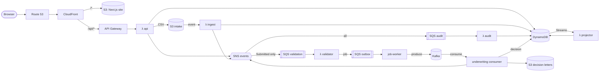

# fakecloud proof of concept

**Can a full, event-driven AWS application be built, deployed and tested entirely on a laptop, with no AWS account, using [fakecloud](https://fakecloud.dev)?**

This repository answers that question by trying it. It is a proof of concept for
evaluating fakecloud as a local stand-in for AWS. It is not a product; the loan
application it contains is the test workload. The workload is deliberately
production-shaped: Terraform IaC, Node.js Lambdas, SNS fan-out, SQS with DLQs,
DynamoDB Streams, S3 events, API Gateway, CloudFront, Route 53, Kafka job
processing with Confluent's client, and a Next.js front end. It pushes on the
parts emulators usually get wrong: the wiring *between* services.

**Result:** the whole stack runs on fakecloud, from `terraform apply` to a browser
at `http://app.fcpoc.localhost:4566`. 22 automated tests pass against it. Getting
there surfaced 15 findings: fakecloud bugs, gaps and design constraints, 12 of
which needed small, documented, local-only workarounds. They are written up in
**[docs/fakecloud-findings.md](docs/fakecloud-findings.md)**, the main output of
this POC.

## What gets exercised

| AWS capability | How this project uses it | Verified by |
|---|---|---|
| **Terraform** (`hashicorp/aws` v6) | ~70 infrastructure resources (130+ state entries with the site files) applied to fakecloud; a second plan must be empty (`make drift`) | `make up`, idempotent `plan` |
| **Lambda** (Node.js 24, real containers) | 5 functions: API, S3 ingest, SQS validator, SQS audit, Streams projector | `fc.lambda.getInvocations()` |
| **API Gateway** HTTP API | `$default` route → `api` Lambda (payload v2) | `fc.apigatewayv2.getRequests()` |
| **SNS** | One event topic; filter policy routes only `ApplicationSubmitted` to validation | `fc.sns.getMessages()` |
| **SQS** | Validation, audit, underwriting outbox, each with a DLQ; partial batch failures | queue state + DLQ receive |
| **DynamoDB** + **Streams** | Single table + GSI; conditional state transitions; stream → stats projector with `FilterCriteria` | API reads, stats test |
| **S3** | Intake (CSV → Lambda notification), results (decision letters), audit log, website hosting | object reads |
| **MSK / Kafka** | Topic `underwriting.jobs`, 3 partitions, produced and consumed with `@confluentinc/kafka-javascript` | end-to-end approval test |
| **CloudFront** | `/*` → S3, `/api/*` → API Gateway, alias domain, CloudFront Function | requests routed by `Host` |
| **Route 53** | Hosted zone, alias to CloudFront, record that routes CloudFront → API Gateway | `fc.dnsResolve()` |
| **Next.js 16** | Static export: dashboard, application form, CSV bulk upload, detail + timeline | deep-link and browser checks |

## Architecture



An application moves `SUBMITTED → VALIDATED → UNDERWRITING → APPROVED | DECLINED`
(or `→ REJECTED` at validation). Every hop is asynchronous and at least once.
Every consumer is idempotent through conditional writes. See
**[docs/architecture.md](docs/architecture.md)** for the flow, data model, and
local-vs-AWS differences.

## Quick start

Requirements: Docker (Docker Desktop, Colima, or native Linux, where the Makefile adds
`docker-compose.linux.yml` for finding 15), Node.js 22+ (24 recommended), `make`.
Terraform is optional: `scripts/tf.sh` falls back to the official Terraform image.

```bash
npm ci
make up      # build → start fakecloud → terraform apply → start Kafka worker (~2 min cold)
make test    # 8 unit + 14 end-to-end tests (~15 s warm)
```

Then open **http://app.fcpoc.localhost:4566**. Browsers resolve `*.localhost` to
127.0.0.1, and fakecloud's CloudFront data plane routes the request by its `Host`
header. Submit an application or upload the sample CSV and watch it move through
the pipeline.

```bash
make logs    # fakecloud + worker logs
make down    # stop everything and discard state (fakecloud runs in memory)
make help    # all targets
```

## Repository layout

```
packages/core/          shared domain logic: validation, underwriting model, DynamoDB repository, events
services/functions/     Lambda handlers (api, ingest, validator, audit, projector), bundled with esbuild
services/job-worker/    Kafka worker: SQS outbox → Kafka relay + underwriting consumer group (Dockerfile)
web/                    Next.js 16 static-export UI
infra/                  Terraform: shared `app` module, local (fakecloud) and aws environments — see infra/README.md
tests/                  end-to-end suite using the fakecloud SDK — see tests/README.md
docs/                   findings, architecture, AWS deployment guide
docker-compose.yml      fakecloud (with its DNS resolver) + worker container; *.linux.yml override for native Linux
```

## Documentation

| Document | Read it for |
|---|---|
| [docs/fakecloud-findings.md](docs/fakecloud-findings.md) | **The evaluation:** what worked, 15 findings with evidence, workarounds and upstream fixes |
| [docs/architecture.md](docs/architecture.md) | Event flow, state machine, data model, local vs AWS |
| [docs/deploying-to-aws.md](docs/deploying-to-aws.md) | Deploying the same stack to AWS + Confluent Cloud (validated, not yet applied) |
| [infra/README.md](infra/README.md) | Terraform layout, running it, local guard rails |
| [tests/README.md](tests/README.md) | How the e2e suite asserts on asynchronous behavior |

## Scope and limitations

- **fakecloud-first.** The local stack is the tested path. The `aws` environment
  passes `terraform validate` and shares the same module, but it has not been
  applied to a real account as part of this POC.
- **Kafka consumption is a container, not a Lambda.** fakecloud has no Kafka →
  Lambda event source mapping (finding 14), and the MSK broker is only reachable
  from containers when fakecloud runs in Docker (finding 13).
- **Pinned to observations from fakecloud 0.46.0.** CI runs weekly against
  `fakecloud:latest`. When a workaround stops being needed, turn off its
  `fakecloud_*` flag and update the findings.
- The loan model is illustrative: deterministic scoring, not real credit policy.
