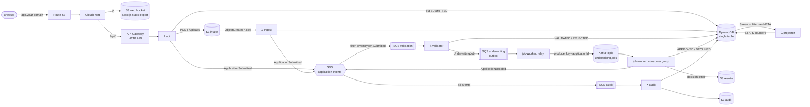

# Architecture

The application is a small loan-processing desk. It exists to give fakecloud a
realistic, production-shaped workload, with every hop asynchronous and at least
once, so the emulator's cross-service wiring gets a real workout. The same
Terraform module deploys it to fakecloud and to AWS.

## Flow



Every SQS queue has a DLQ (`maxReceiveCount = 3`).

## Status lifecycle

```
SUBMITTED ──validator──▶ VALIDATED ──worker──▶ UNDERWRITING ──▶ APPROVED
    │                                                        └──▶ DECLINED
    └──validator──▶ REJECTED   (business rules failed; never reaches Kafka)
```

Every transition is a DynamoDB conditional update (`status IN (:expected)`).
That makes each consumer idempotent: SNS, SQS and Kafka all deliver at least
once, and a replayed or out-of-order message is a no-op. The e2e suite replays
a message to prove it.

## Components

| Component | Where | Role |
|---|---|---|
| `packages/core` | shared library | Domain types, validation rules, underwriting model, CSV parser, DynamoDB repository, event publishing |
| `api` Lambda | API Gateway `$default` route | REST: submit, list, get (with timeline), stats, decision letter, CSV upload |
| `ingest` Lambda | S3 notification | Bulk-loads CSV rows. IDs are derived from bucket/key/etag/row, so re-deliveries don't duplicate |
| `validator` Lambda | SQS ESM, `ReportBatchItemFailures` | Business-rule validation. Enqueues underwriting jobs on the outbox |
| `audit` Lambda | SQS ESM (raw SNS delivery) | Writes the timeline to DynamoDB and immutable JSON to S3 |
| `projector` Lambda | DynamoDB Streams ESM, `FilterCriteria` | Keeps status counters in sync |
| `job-worker` | container (Compose locally, ECS Fargate on AWS) | Relays the SQS outbox onto Kafka and consumes it to underwrite |
| `web` | Next.js 16 static export on S3 + CloudFront | Dashboard, application form, CSV upload, detail and timeline |

### Why an SQS outbox in front of Kafka

The validator Lambda doesn't talk to Kafka directly. It writes an
`UnderwritingJob` to an SQS queue, and the worker relays those jobs onto the topic
(deleting from SQS only after the broker acks). This keeps Kafka clients and
credentials out of the Lambdas. It also mirrors the common production pattern of
a Confluent SQS source connector. And it sidesteps fakecloud's lack of a
Kafka → Lambda event source mapping.

### Data model (single table)

| pk | sk | item |
|---|---|---|
| `APP#<id>` | `META` | the application (GSI1: `gsi1pk=APPLICATION`, `gsi1sk=<createdAt>#<id>` for newest-first listing) |
| `APP#<id>` | `EVT#<iso>#<type>` | timeline entry |
| `STATS` | `GLOBAL` | counters per status |

## Local vs AWS

| Concern | `infra/envs/local` (fakecloud) | `infra/envs/aws` |
|---|---|---|
| Kafka | MSK API → real `apache/kafka` broker container | Confluent Cloud (cluster, topic, service account, API key) |
| Worker | `docker compose --profile worker` | ECS Fargate, image in ECR, SASL creds in Secrets Manager |
| Web origin | public S3 website endpoint | private bucket with Origin Access Control |
| Directory URLs | duplicated `dir/` keys (fakecloud workaround) | CloudFront Function `rewrite-index` |
| TLS / domain | `http://app.fcpoc.localhost:4566` (`*.localhost` resolves in browsers) | ACM certificate, `https://app.<your-domain>` |
| API origin DNS | Route 53 record answered by fakecloud's `--dns` resolver | real `execute-api` hostname |
| Credentials | static `test` keys | IAM roles per function and task |

The application code is identical in both. The only switch is `AWS_ENDPOINT_URL`,
which the AWS SDK v3 honors natively.
